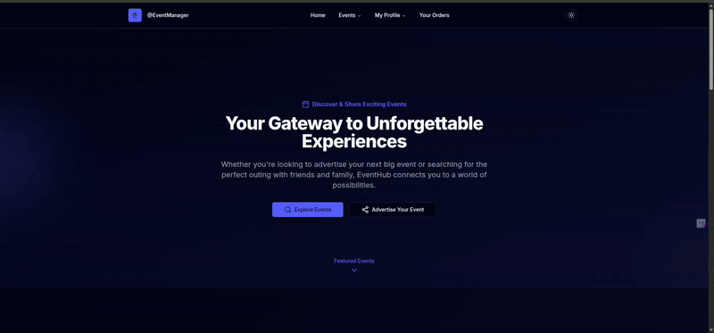
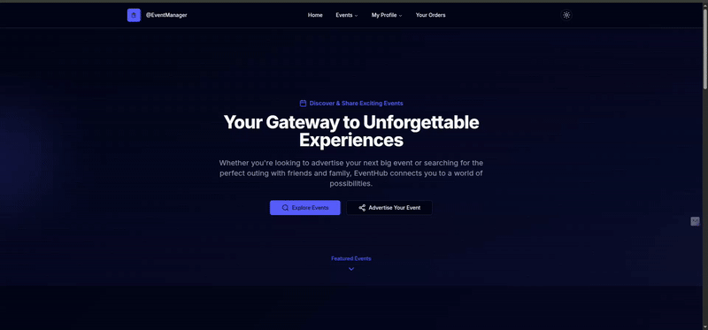
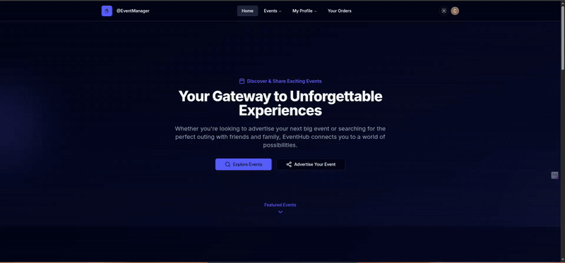
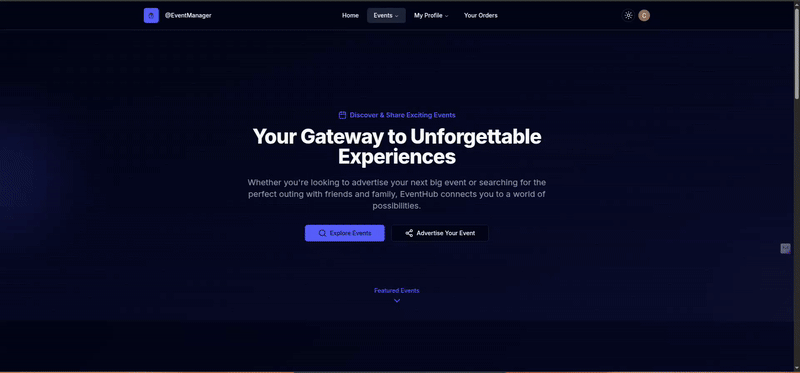

<div align="center">

⭐ **If you like this project, please star the repository!** ⭐ <br>
------- 👇 **Live Demo Below** 👇 --------

<hr>
</div>

<div align="center">
<a href="https://github.com/Bas3L3ss/event-management-platform" target="blank">

</a>

<h2>Event Management & Advertisement Platform</h2>


</div>

## 💡 Overview

A modern event management platform built with Next.js, designed to connect event organizers with attendees. This platform offers a seamless experience for discovering, creating, and managing events with features focused on user engagement and event promotion.

## 🎬 Demo

**🔐 Seamless User Authentication**

- **Register and login users effortlessly with Clerk Auth**

  
  

**📨 Social App-Like User Experience**

- **Seamless user navigation (sub 0.1s latency)**

  

- **Easy to deploy advertisement**

  
  

- **Following and keeping track with your followeres!**

  

## ✨ Features

- **📅 Event Management & Advertisement:** Create, edit, manage, search and promote events with rich text descriptions
- **👥 Media-like Experience:** An interactive platform where users can follow each other and stay updated.
- **🌟 Featured Events:** Showcase premium events with enhanced visibility
- **💬 Interactive Comments:** Engage with attendees through a robust comment system
- **📱 Responsive Design:** Fully responsive interface across all devices
- **🔐 User Authentication:** Secure authentication powered by Clerk
- **🎨 Theme Support:** Light/dark mode with customizable UI
- **📍 Location Integration:** Map integration for event locations

## 👩‍💻 Tech Stack

- **Next.js 14:** Server-side rendering and modern React features
- **TypeScript:** Type-safe development environment
- **Prisma:** Type-safe database access and management
- **Clerk:** Authentication and user management
- **Tailwind CSS:** Utility-first styling
- **Radix UI:** Accessible component primitives
- **React query:** Modern fetching pattern
- **React Hook Form:** Form validation and handling
- **Zod:** Schema validation
- **Supabase:** File storage and database

## 📦 Getting Started

### 🚀 Prerequisites

- Node.js (v18.x or higher)
- npm or yarn
- PostgreSQL database

### 🛠️ Installation

1. **Clone the repository:**

   ```bash
   git clone https://github.com/Bas3L3ss/event-management-platform
   cd event-management-platform
   ```

2. **Install dependencies:**

   ```bash
   npm install
   ```

3. **Set up environment variables:**
   Create a `.env` file with:

   ```env
    CLERK_ADMIN_ID =  ""
    NEXT_PUBLIC_CLERK_PUBLISHABLE_KEY= ""
    CLERK_SECRET_KEY= ""
    STRIPE_SECRET_KEY = ""
    NEXT_PUBLIC_STRIPE_PUBLISHABLE_KEY = ""
    DATABASE_URL =  ""
    DIRECT_URL =  ""
    SUPABASE_URL =  ""
    SUPABASE_KEY =  ""
    CLERK_WEBHOOK_SECRET = ""
   ```

4. **Run database migrations:**

   ```bash
   npx prisma generate
   npx prisma db push
   ```

5. **Start the development server:**
   ```bash
   npm run dev
   ```

## 📖 Usage

Visit `http://localhost:3000` to access the application. Create an account to:

- Browse and search events
- Create and manage your own events
- Interact with other users through comments
- Follow event organizers
- Book tickets for events

## 🤝 Contributing

1. Fork the repository
2. Create your feature branch (`git checkout -b feature/AmazingFeature`)
3. Commit your changes (`git commit -m 'Add some AmazingFeature'`)
4. Push to the branch (`git push origin feature/AmazingFeature`)
5. Open a Pull Request

## 📜 License

This project is licensed under the MIT License - see the [LICENSE](LICENSE) file for details.

## 🚀 Future Roadmap

- **📊 Enhanced Analytics Dashboard**

  - Real-time event performance metrics
  - Attendee engagement tracking
  - Custom reporting tools

- **🎯 Smart Event Advertisement**

  - AI-powered targeting recommendations
  - Automated promotional campaigns
  - Multi-channel marketing integration

- **🔍 Advanced Search & Discovery**

  - Vector-based similarity search
  - Personalized event recommendations
  - Interest-based event matching

- **🤖 AI-Powered Features**

  - Smart event categorization
  - Automated content moderation
  - Intelligent pricing suggestions

- **📱 Enhanced User Experience**
  - Improved mobile experience
  - Real-time notifications
  - Social media integration
